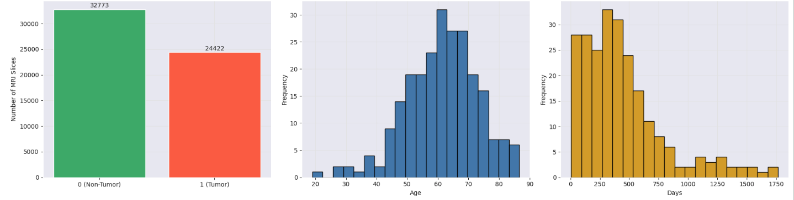
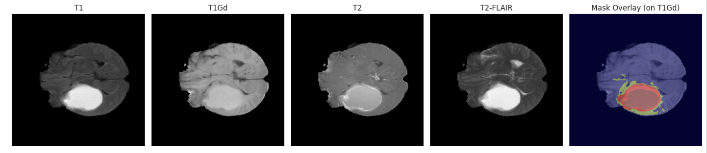
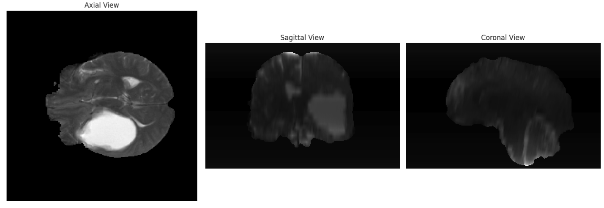
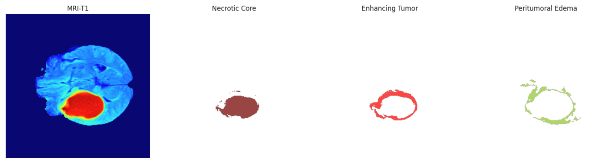
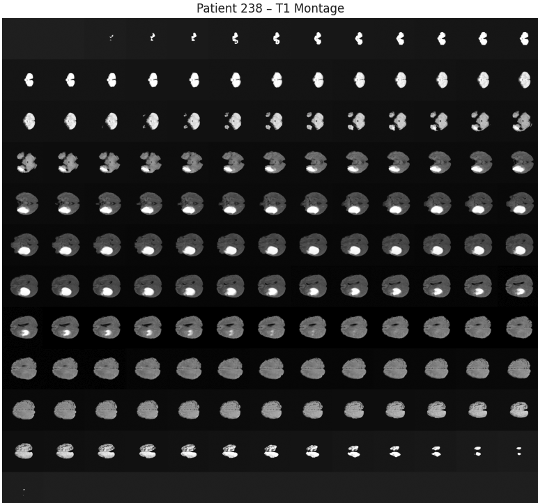
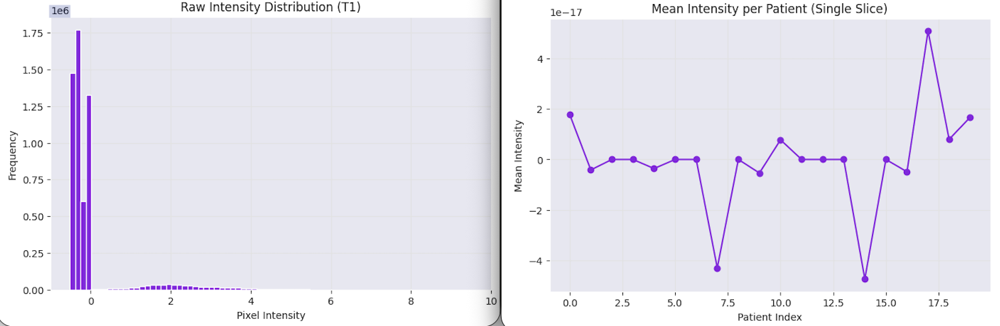
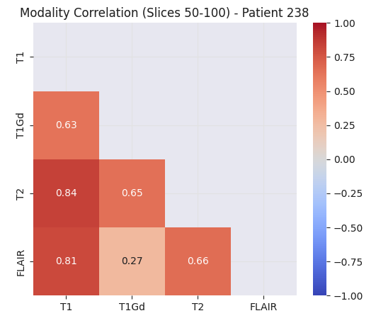
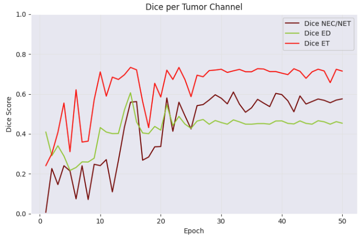
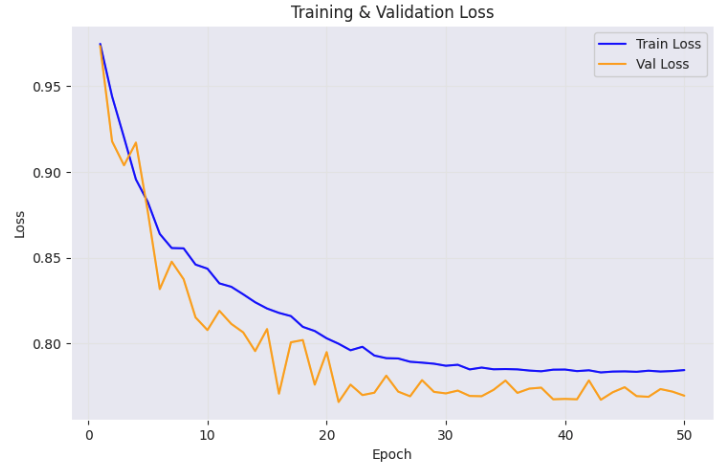

[![Issues][issues-shield]][issues-url]

<h1 align="center">BraTS-UNet</h1>
<h2 align="center">Brain Tumor Segmentation with U-Net on Multi-Modal MRI</h2>
  

     
    <a href="https://github.com/rc-9/DepMap_HRD_PARPi/issues">Report Bug</a>
    ·
    <a href="https://github.com/rc-9/DepMap_HRD_PARPi/issues">Request Feature</a>
  

<!-- TABLE OF CONTENTS -->

  
Table of Contents

  <ol>
    <li><a href="#problem-definition">Problem Definition</a></li>
    <li><a href="#data-overview">Dataset Overview</a></li>
    <li><a href="#methodology">Methodology</a></li>
    <li><a href="#results">Results</a></li>
    <li><a href="#conclusions">Conclusions</a></li>
  </ol>

## Project Walkthrough

### Problem Definition

Gliomas are challenging to diagnose and delineate due to their heterogeneous shape, size, and location. This project explores modern segmentation algorithms to tackle this problem using publicly-available MRI scans. These images have been annotated with specific tumor subregions by expert neuroradiologists, providing a reliable ground truth for model training and evaluation.

The table below outlines the high-level project scope:

|  |  |
| :--- | :--- |
| **Task** | 2D semantic segmentation; each slice will be processed independently while approximating 3D tumor structure |
| **Input** | Multi-channel MRI slices (T1Gd & T2-FLAIR only for baseline version) |
| **Output** | Multi-channel segmentation masks with the same spatial dimensions as input |
| **Metrics** | - Primary: Dice coefficient (and Dice loss for optimization)   - Secondary: IoU, pixel accuracy, precision & recall |
| **Constraints** | - Training runtime ≤ 4–6 hours (to ensure stability on free-tier Colab T4 GPU)   - Dataset size is moderate; batch size & network depth must balance speed & memory   - Avoid heavy augmentation |
| **Success Criteria** | - Competitive baseline Dice for a lightweight, reproducible model   - Complete training within runtime limits   - Predictions visually align with ground truth (no major over/under-segmentation) |

(<a href="#top">back to top</a>)

---
---
---

### Data Overview

This project uses the [BraTS 2020 training dataset](https://www.med.upenn.edu/cbica/brats2020/data.html), consisting of multi-modal brain MRI volumes with expert-annotated tumor subregions. Each patient volume contains co-registered MRI modalities along with pixel-wise segmentation masks.

#### Metadata

Inspection of the metadata and survival information reveals a slice-level class imbalance (tumor vs. non-tumor), variability in patient ages, and variability in survival outcomes. 

---

#### Imaging Modalities

The imaging data is organized at the slice level for modeling convenience. In total, there are 57k+ 2D slices derived from 369 patients. Because slices from the same patient are highly correlated, train/validation splits must be performed at the patient level to prevent data leakage. Each slice mantains spatial alignment across modalities, enabling multi-channel input into segmentation networks. The four MRI modalities capture complementary information:
- **T1**: Baseline anatomical structure
- **T1Gd**: Post-contrast scan highlighting enhancing tumor regions
- **T2**: Emphasizes fluid-rich regions
- **T2-FLAIR**: Suppresses CSF signal, isolating edema and infiltrative tumor signal that may blend with fluid in T2

The example below (Volume 238, Slice 67) demonstrates visual differences across modalities and confirms cross-channel alignment.

<!-- It is important to also keep in mind that although modeling is performed slice-wise in 2D, MRI volumes are inherently three-dimensional and can be viewed in multiple anatomical planes (Axial, Coronal, Sagittal). Furthermore, tumor regions occupy only a small fraction of each slice. This creates a severe class imbalance where the healthy background tissue dominates. This calls for Dice-based optimization and appropriate model evaluation metrics in lieu of raw accuracy. -->

---

#### Spatial Perspectives

Although modeling is performed slice-wise in 2D, MRI volumes are inherently three-dimensional and can be viewed in multiple anatomical planes:
- **Axial plane**: Horizontal cross-section (most common view)
- **Coronal plane**: Divides anterior and posterior regions
- **Sagittal plane**: Divides left and right hemispheres

---

#### Tumor Subregions

Segmentation masks are multi-channel tensors where each channel is a binary map to a tumor subregion:
- **Necrotic / Non-Enhancing Core (NET/NEC)**: Central tumor core (dead tissue) 
- **Enhancing Tumor (ET)**: Actively enhancing tumor rim, typically outlining the core
- **Peritumoral Edema (ED)**: Surrounding edema extending beyond ET

Overlay visualizations confirm correct spatial alignment between MRI input and mask targets.

---

#### Pixel-Level Class Imbalance

Tumor regions occupy only a small fraction of each slice. This creates a severe class imbalance where the healthy background tissue dominates. This calls for Dice-based optimization and appropriate model evaluation metrics in lieu of raw accuracy.

---

#### Intensity Variability

Raw intensity ranges vary significantly across slices and patients, revealing the need for normalization to stabilize training.

In order to analyze relationships across modalities without background dominance skewing results, correlation was computed for only the middle-third slice set for an example patient. This showed strong overlap between T1 and T2 intensities and a notable divergence between T1Gd and T2-FLAIR. This suggests that while some modalities carry overlapping information, contrast-enhanced T1Gd and T2-FLAIR provide distinct signal characteristics. These may serve as strong candidates for a computationally-efficient baseline configuration.

(<a href="#top">back to top</a>)

---
---
---

### Methodology

#### Preprocessing Pipeline

To ensure stable and leakage-free training, preprocessing was performed at both the patient and slice levels.
- **Patient-level split**: Train/validation separation was performed at the patient level to prevent correlated slices from appearing in both sets.
- **Slice extraction**: 3D MRI volumes were decomposed into 2D axial slices to reduce computational cost and enable training within Colab GPU limits.
- **Modality selection**: Only T1Gd and T2-FLAIR were used for the baseline configuration, balancing representational strength and efficiency.
- **Intensity normalization**: Each slice was normalized independently to reduce inter-patient intensity variability and stabilize optimization.
- **Resizing**: Slices were downscaled to a uniform spatial resolution to reduce memory usage and accelerate training.
- **Mask encoding**: Tumor subregions were converted into a 3-channel binary tensor (NEC/NET, ED, ET), enabling multi-label segmentation.
  
---

#### Model Architecture

A standard **U-Net** architecture was implemented as the baseline segmentation model.
- Encoder–decoder structure with symmetric skip connections
- Progressive downsampling to capture contextual features
- Skip connections to preserve fine-grained spatial information
- Final 1×1 convolution projecting to 3 output channels

The network operates on 2D slices independently. While this removes volumetric context, it significantly reduces computational burden and allows rapid experimentation. The architecture was intentionally kept lightweight to establish a reproducible baseline before introducing architectural complexity.

---

#### Training Strategy

Training was designed to balance stability, efficiency, and interpretability.

- **Loss function:** Dice loss (multi-label formulation) to directly optimize overlap under severe class imbalance
- **Optimizer:** Adam with adaptive learning rates
- **Learning rate scheduling:** ReduceLROnPlateau based on validation Dice
- **Batch size & epochs:** Tuned to remain within free-tier Colab GPU runtime constraints
- **Checkpointing:** Model weights saved each epoch to mitigate session interruptions

v1 prioritizes stability and clarity over peak performance, serving as a clean baseline for iterative improvement. On the other hand, v2 scales up by incorporating attention mechanisms and data augmentation techniques, in addition to using a larger training set.

---

#### Evaluation Protocol

Model performance was evaluated on a held-out validation set using both quantitative and qualitative analysis.

- **Primary metric:** Mean Dice coefficient across tumor subregions
- **Per-class Dice:** NEC/NET, ED, and ET evaluated independently
- **Slice-level visualization:** Predicted masks compared directly to ground truth

Using both metrics and visual inspection helps avoid misleading conclusions.

(<a href="#top">back to top</a>)

---
---
---

### Results

The baseline U-Net was evaluated on the validation set across various metrics. A subset (for every 5 epochs) is shown below:

|epoch|train\_loss|val\_loss|mean\_dice|dice\_NEC/NET|dice\_ED|dice\_ET|prec\_NEC/NET|prec\_ED|prec\_ET|recall\_NEC/NET|recall\_ED|recall\_ET|
|---|---|---|---|---|---|---|---|---|---|---|---|---|
|1\.0|0\.975|0\.973|0\.219|0\.006|0\.41|0\.241|0\.003|0\.22|0\.058|0\.4|0\.473|0\.373|
|6\.0|0\.864|0\.832|0\.309|0\.074|0\.232|0\.621|0\.04|0\.246|0\.271|0\.389|0\.303|0\.37|
|11\.0|0\.835|0\.819|0\.423|0\.271|0\.409|0\.589|0\.067|0\.292|0\.209|0\.387|0\.304|0\.389|
|16\.0|0\.818|0\.771|0\.581|0\.562|0\.46|0\.721|0\.123|0\.369|0\.236|0\.285|0\.347|0\.398|
|21\.0|0\.8|0\.766|0\.615|0\.58|0\.546|0\.72|0\.141|0\.369|0\.271|0\.203|0\.354|0\.385|
|26\.0|0\.791|0\.772|0\.567|0\.542|0\.464|0\.694|0\.121|0\.342|0\.279|0\.211|0\.362|0\.376|
|31\.0|0\.788|0\.773|0\.569|0\.55|0\.449|0\.708|0\.118|0\.335|0\.279|0\.206|0\.361|0\.379|
|36\.0|0\.785|0\.771|0\.584|0\.573|0\.452|0\.727|0\.126|0\.343|0\.278|0\.206|0\.36|0\.379|
|41\.0|0\.784|0\.767|0\.572|0\.566|0\.453|0\.697|0\.128|0\.339|0\.284|0\.209|0\.368|0\.376|
|46\.0|0\.784|0\.769|0\.588|0\.575|0\.466|0\.724|0\.146|0\.349|0\.285|0\.193|0\.375|0\.364|
|50\.0|0\.785|0\.77|0\.581|0\.576|0\.453|0\.715|0\.131|0\.342|0\.285|0\.208|0\.367|0\.371|

**Mean Dice**: 0.58  
**Necrotic / Non-Enhancing Core (NEC/NET)**: 0.58  
**Peritumoral Edema (ED)**: 0.45   
**Enhancing Tumor (ET)**: 0.71 

The model segments **ET** more reliably than NEC/NET or ED, reflecting the inherent class imbalance and boundary heterogeneity in MRI slices. Overall performance is modest, as expected for a small-sample baseline designed for fast prototyping.

The training and validation loss plot shows that the network converges steadily over epochs, with validation loss generally following the training trend. Stabilizes after epoch 20, with minor fluctuations indicating sensitivity to small batch sizes and slice-level variance.

Slice-level visualizations highlight spatial predictions versus the pre-annotated masks:
- Predicted masks capture ET rims well but struggle with diffuse edema and small necrotic cores.
- Visual inspection confirms alignment of predicted tumor subregions with anatomical structures in high-confidence slices.
- Performance varies across slices, emphasizing the importance of both quantitative metrics and slice-level visualization in medical imaging.

An example slice for a validation volume is shown below for illustrative purposes. In reality, visual assessments of predictions vary substantially across slices.

(<a href="#top">back to top</a>)

---
---
---

### Conclusions

This project establishes a baseline 2D U-Net pipeline for multi-class brain tumor segmentation from multi-modal MRI slices:
- The model reached a mean Dice score of **0.581**. Performance was strongest on enhancing tumor (ET) regions, while necrotic core and edema remained challenging, largely due to class imbalance and less distinct boundaries.
- Slice-level visualizations show predictions that generally follow anatomical structure, with noticeable variability across cases.
- The pipeline is modular end-to-end; data loading, preprocessing, training, validation metrics, and qualitative review are all structured for reproducibility.

Overall, this serves as a solid starting point for further tuning, data balancing strategies, and architectural improvements toward more clinically reliable segmentation.

(<a href="#top">back to top</a>)

---
---
---

<!-- MARKDOWN LINKS & IMAGES -->
[issues-shield]: https://img.shields.io/github/issues/rc-9/BraTS_UNet.svg?style=for-the-badge
[issues-url]: https://github.com/rc-9/BraTS_UNet/issues
